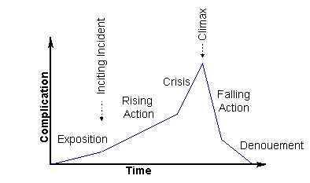

# Boss Design

https://www.youtube.com/watch?v=ywshx1HPZU4

- Telegraphing attacks
  - The more difficult/powerful the attack the longer the telegraph should be
  - One way to increase difficulty is to shorten the telegraph

- Serve as an exam of game mechanics learned so far
  - Sometimes have unique new game mechanics

- Phases that change attack patterns
  - Dramatic Arc

    
  - Give variety
  - Escalate stakes
  - Gives player many victories throughout the fight
    - Even if they die, they will be happy if they
