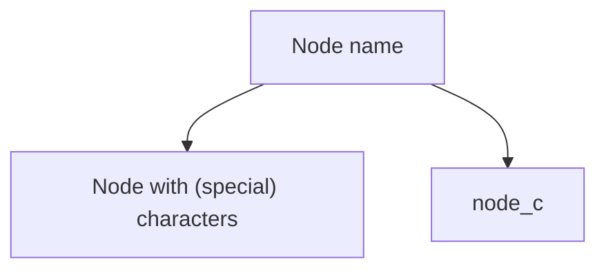
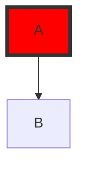

# Flow Charts in Mermaid

````

```mermaid
flowchart TD
    node_a[Node name] --> node_b["Node with (special) characters"]
    node_a --> node_c
```
````


```mermaid
flowchart TD
    node_a[Node name] --> node_b["Node with (special) characters"]
    node_a --> node_c
```

## Orientations
- `TD`: Top-Down
- `BT`: Bottom-Top
- `LR`: Left-Right
- `RL`: Right-Left

## Styling nodes

````

```mermaid
flowchart TD
  A:::enemy --> B

  classDef enemy fill:#f00,stroke:#333,stroke-width:4px;
```
````


```mermaid
flowchart TD
  A:::enemy --> B

  classDef enemy fill:#f00,stroke:#333,stroke-width:4px;
```
