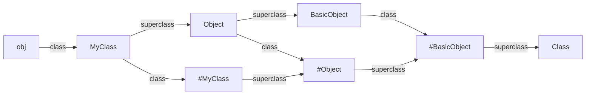

# Paolo Perrotta - Metaprogramming Ruby

{ height: 200px; }

[Amazon](https://www.amazon.com/Metaprogramming-Ruby-Program-Like-Facets/dp/1941222129)

## Chapter 3 - Blocks
- New scopes are started inside
  - A class defined with `class` keyword
  - A module defined with the `module` keyword
  - A method defined witht the `def` keyword
- To use something from an existing scope you must use the dynamic definition methods `Class.new`, `Module.new`, `define_method`
- Use `BasicObject` derived classes as clean room for DSL execution to have less methods available

## Chapter 4 - Class definitions
- `class` keyword = `class_eval` = `instance_eval` on the Class object
- Inside a class definition you can:
  - `self` is the class inside

- Super class of a singleton class is singleton class of superclass

---

## My Questions, Thoughts, Comments
