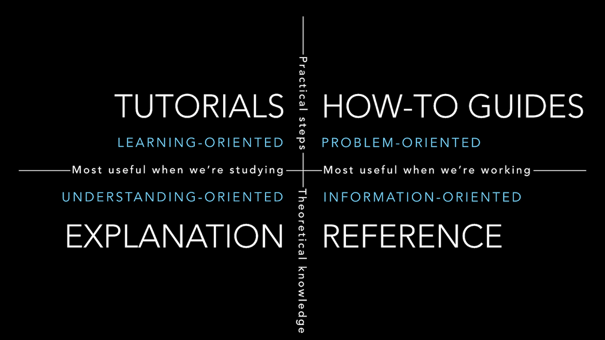

# Four Types of Documentation

Source: https://documentation.divio.com/

> It doesn't matter how good your product is, because **if it's documentation is not good enough, people will not use
  it**

## Overview over the four types of documentation

{ height: 400px }

- Tutorial
  - oriented to learning
  - must allow the newcomer to get started
  - presented as a lesson
  - like teaching a small child how to cook
- How-to guide
  - oriented to achieving a goal
  - must show how to solve a specific problem
  - presented as a series of steps
  - like a recipe in a cookery book
- Reference
  - oriented to information
  - must describe the machinery
  - presented as a dry description
  - like a reference encyclopedia article
- Explanation
  - oriented to understanding
  - must explain the why, backgrounds etc
  - presented as a discursive explanation
  - like an article on culinary social history

Following this distinction will help both the author (they will know what and how to write) and the reader.

## Tutorials
- You are the teacher and responsible for leading the student through a series of steps to achieve some end
- Must be achievable and meaningful
- Once the tutorial is finished the learner can make sense of the software and the rest of the documentation
- **What** to teach is less important than that the learner
  - finds it enjoyable
  - gains confidence
  - wants to do it again
- Through the tutorial the learner will learn some important things about the software, how it is to use the software
  day by day
- You decide what the learner will learn and in which order - the goal is basic familiarity with the software!

### Principles for writing them
- Let the user learn by doing
- It's ok to have hand-held baby steps at first, what they do doesn't have to be best practice just needs to get them
  started
- Make sure the tutorial works!
  - You cannot help the learner if something fails, make sure it works!!!
- Each step should do something small and comprehensible, it should be visible
  - Don't let them do random, complicated things for 2 pages before seeing any feedback
- It must be repeatable for people with many different environments
- Focus on concrete steps, particular actions and outcomes
- Only give the minimum necessary explanation - link to refeerence/explanation elsewhere
  - Don't introduce other unneeded options

## How-to guides
- Presents steps required to solve a real-world problem
  - The question asked could only be posed by someone with some experience
- You wouldn't explain basics that normally experienced people know already or discuss concepts

### Principles for writing them
- Provide a series of steps to achieve the goal
  - No need to start from the beginning or go to the very end, just include the main important part
- Focus only on the goal
- Link to explanations if they are important to the steps
- Be flexible enough to allow for variations of the problem you describe
- Name them as a complete "How to"-sentence

## Reference
- Technical description of a machinery
- Can include basic description of how to use something and what to pay attention to when using
  - But does not contain steps to achieve a particular goal! That's job of the How-to guides
- You want pure information in a systematic presentation

### Principles for writing them
- Structure the reference around the code
- Use consistent structure, format, tone
- Do nothing but describe!
- It must be exact and up-to-date

## Explanation
- Background, Other notes, Key Topics
- Discusses and explains concepts
- Examples:
  - Explain why we do things they way we do the
    - Design decisions, historical reasons, technical constraints
  - Describe bad ways or obscure alternatives
- The user doesn't need to know these things
- The user could also read this for leasure away from the computer
