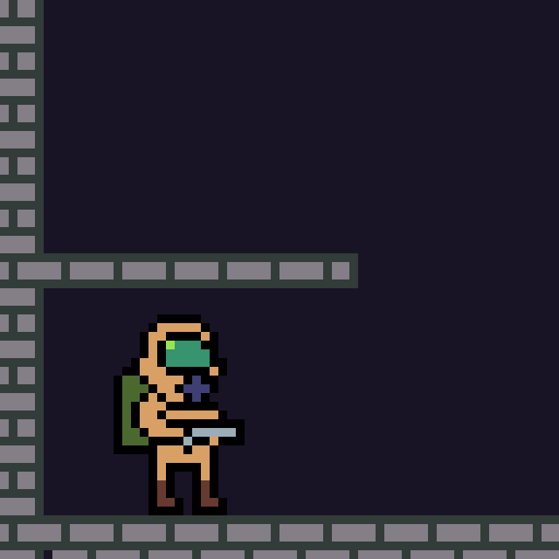
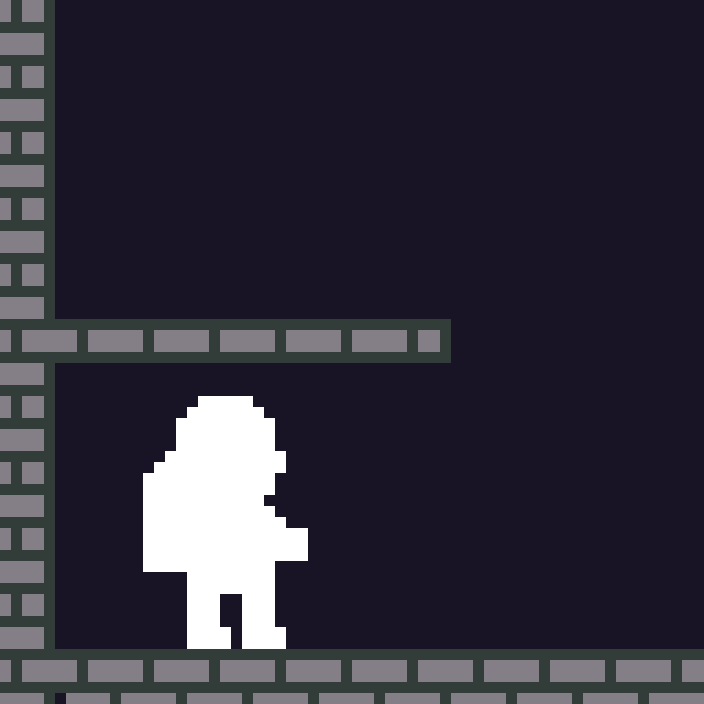

# Make a Sprite flash

{ height: 256px }&nbsp; &nbsp; &nbsp; &nbsp;
{ height: 256px }

You achieve a flashing effect by drawing a colored solid over your sprite while using additive blending
(`blendmode_enum` 2). The background behind the sprite must be transparent though when you render the white rectangle
on top - so you need to render it first on a separate render target otherwise the rectangle would also blend with your
stage etc.

```rb
def flashing_sprite(args, sprite, render_target_name, r: 255, g: 255, b: 255)
  # Prepare render target in sprite size
  render_target = args.outputs[render_target_name]
  render_target.width = sprite[:w]
  render_target.height = sprite[:h]

  # Render sprite at bottom left of render target
  render_target.primitives << sprite.merge(x: 0, y: 0)
  # Additive with colored rectangle
  render_target.primitives << sprite.to_solid(x: 0, y: 0, r: r, g: g, b: b, blendmode_enum: 2)

  # Return render target as sprite
  { x: sprite[:x], y: sprite[:y], w: sprite[:w], h: sprite[:h], path: render_target_name }.sprite!
end

sprite = { x: player.position.x, y: player.position.y, w: 16:, h: 24, path: 'player.png' }.sprite!
args.outputs.primitives << flashing_sprite(args, sprite, :flashing_player)
```


