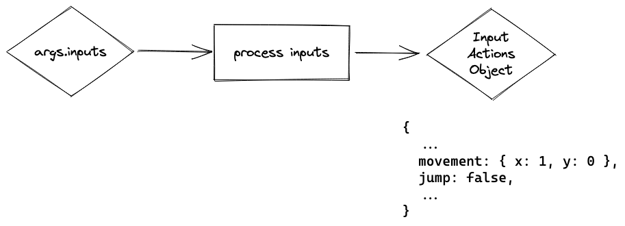

# Input Actions

Instead of using `args.inputs` directly you parse it into an input actions objects, which is then used instead to
control your game.



## When is it useful?
Some scenarios when this pattern can be useful:
- Having several different kinds of inputs with the same effect
- Configurable controls
- Letting an AI player control your game (character)
- Multiplayer

In general I think it results in cleaner, better organized code but YMMV of course.

## Background & Principles
When developing complex pieces of software it often pays off to divide your program into separate independent small
pieces that have clear-cut responsibilities and can live independently from each other.

Processing raw player inputs provided by `args.inputs` and converting them into a more abstract object describing
actions the player takes in one distinct step at the beginning of your tick will allow you to tinker with your control
scheme without having to track down your input code all over the place.

One natural way to approach this pattern would be to imagine that your game controls could be configured in your game's
option menu (even if you are in fact still very far away from actually having any menus). Each of the controls that
could be re-assigned to a different button would be one type of input event that can be returned by your processing
function.

Abstracting controls away to these kind of input action objects, gives you also the advantage that your remaining game
logic can now be called with them instead of having to pass `args.inputs` directly.

If you have enemy characters that are gameplay-wise similar to your player character you could re-use your player
update functions with AI produced input events.

## Implementation Example
```rb
def tick(args)
  input_actions = process_inputs(args.inputs)

  if input_actions[:movement]
    args.state.player.x += input_actions[:movement][:x]
  end

  if input_actions[:jump]
    # Jumping logic
  end
end

def process_inputs(inputs)
  input_actions = {}

  if inputs.keyboard.key_down.space || inputs.keyboard.key_down.up || inputs.keyboard.key_down.w
    input_actions[:jump] = true
  end

  if inputs.keyboard.key_held.left || inputs.keyboard.key_held.a
    input_actions[:movement] = { x: -1 }
  elsif inputs.keyboard.key_held.right || inputs.keyboard.key_held.d
    input_actions[:movement] = { x: 1 }
  end

  input_actions
end
```

## Caveats & Thoughts for more complex scenarios
- You will probably have more than one set of possible actions (gameplay and inside a menu would be classic examples)
  which means that you will need several kinds of `process_inputs` functions for different situations (or use
  `if`/`case` statements to make the distinguishment inside one functions)
- You might need some kind of state in addition to the inputs if you need to process inputs that take longer than 1
  tick, like distinguishing long button presses from short ones
