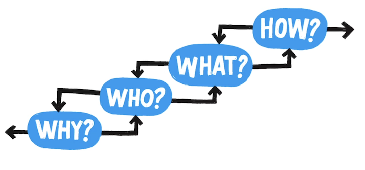

# How to know what to build

Source: {height: 1rem}
[Agile Adria 2013 keynote / Gojko Adzic: Make Impacts Not Software](https://www.youtube.com/watch?v=GnK_n9Udhhs)

## Four questions to find out what to build

{ height: 200px }
- Those questions map to certain elements of planning
  - Why: Big Picture, your end goal
  - Who: Who to address
  - What: What kind of behaviour/change you want to achieve
  - How: Project Scope
- Answering one question helps answering the neighboring ones
- The Big Picture is your Goal in your Navigation system
- You can try out many different Who/What/Hows once you know the why
  - The why will give you a way to measure success
- Each connection uphill is an assumption
  - Who could help me achieve my goal?
  - What kind of behaviour in those people might help to achieve that goal?
  - How to achieve that behaviour change?

## Example: Adding levels & achievements to a Facebook game
(C)ustomer & (M)anager

- C: We want to have levels and achievements for our game.
- M: This is a what - How does this change somebody's behavior.
- C: I don't understand
- M: Imagine we spend 9 months on this and nothing changes in the user's behaviour... have we wasted time?
- C: Yes.
- M: Ok, let's not do that. So give me an example of how the users will behave differently.
- C: They will post to Facebook.
- M: They do that already... what's the change?
- C: They will post a lot more.
  ```mermaid
    flowchart LR
      Players --- pm(Post More)
      pm --- la(Levels and Achievements)
  ```
- M: Ok, so if we deliver 10 % of the above and people don't post more we should stop this - if they do we know we're
  doing something right. So why is it important for people to post more?
- C: If they post more other people might read about our games.
- M: That's another behavior change not a big picture. Why is it important that they read about the games?
- C: If they read about it they will come and play the games more.
- M: That's another behavior change. Why is that important?
- C: That's a stupid question
  - When you hear something like that you're onto something good
- M: So you want more players... How many more? Would it be a waste of time if after 9 months you had 5 more players?
- C: No, no, no we need 1 million more players
  ```mermaid
    flowchart LR
      1m(1M Players) --- Players
      Players --- pm(Post More)
      pm --- la(Levels and Achievements)
  ```
  - He actually had a problem but came with a solution instead, we just had a structured conversation to unpack the
    problem
- M: So this is our destination... and these are some of the roads we could take... Let's not take a tunnel for 9 months
  but let's try out if this is actually a good idea. Something simple we could quickly do would be allowing people to
  post about tournament wins... so we can test the hypothesis about players posting more.
  ```mermaid
    flowchart LR
      1m(1M Players) --- Players
      Players --- pm(Post More)
      pm --- la(Levels and Achievements)
      pm --- tw(Tournament Winners)
  ```

They tried out tournament winners and after three days no one shared their wins anymore because they didn't want to
spam their friends. So making players post more about a stupid Facebook game doesn't seem to work.

- M: We could try to make people invite others
- C: So here we asked our marketing department and they gave us this:
  ```mermaid
    flowchart LR
      1m(1M Players) --- Players
      Players --- pm(Post More)
      pm --- la(Levels and Achievements)
      pm --- tw(Tournament Winners)
      Players --- i(Invite more friends)
      i --- Automated
  ```
- M: No you're doing this again... let's first see if this even makes sense... maybe with something manual
  ```mermaid
    flowchart LR
      1m(1M Players) --- Players
      Players --- pm(Post More)
      pm --- la(Levels and Achievements)
      pm --- tw(Tournament Winners)
      Players --- i(Invite more friends)
      i --- Automated
      i --- Manual
  ```

It didn't work at first, but when they changed the mail template to make the invite button more visible and it actually
helped
