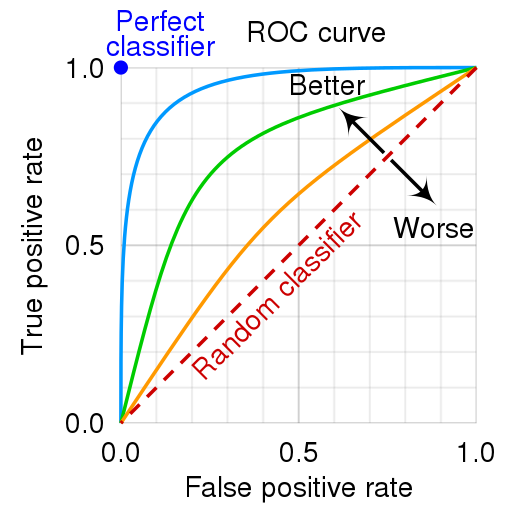

# ROC Curve
- Receiver Operating characteristic curve
- It assumes you have a classification model with some kind of "threshold" you can adjust
  - You can nudge it towards classifying data more easily as positive - which in turn also increases false positives
    or the other way round
- Plots [[concepts.machine-learning.false-positive-rate]] (x) vs
  [[True Positive Rate|concepts.machine-learning.recall]] (y)

(Image by cmglee, MartinThoma, [CC BY-SA 4.0](https://creativecommons.org/licenses/by-sa/4.0), via
[Wikimedia Commons](https://commons.wikimedia.org/wiki/File:Roc_curve.svg))
