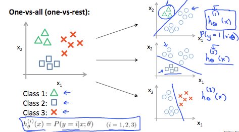

# Multiclass Classification (one-vs-all / one-vs-rest)

If we have several classes we can just treat it as several two class classification problems:

- Train a logistic regression classifier $h_\theta^{(i)}(x) = P(y=1|x;\theta)$ for each class.
- To make a prediction on a new class pick the class $i$ that maximizes $h_\theta^{(i)}(x)$
