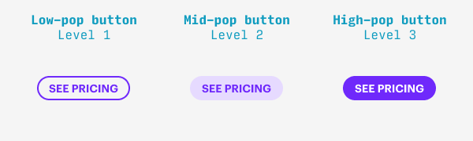

# Colors

## Use HSB for colors
- It's very intuitive compared to RGB
- You can easily make boring colors more interesting by adjusting their hue slightly
  - For example boring blue to a slightly more purplish hue
- Make color less overpowering/visible by reducing saturation

## Theme color and variations
- Choose a theme color
- Light variation: Increase brightness, decrease saturation
- Dark variation: Decrease brightness, increase saturation
- You can make a secondary theme color that feels related to the first one by strongly adjusting brightness/saturation
  while keeping the hue same

## Color Palettes
Usually 4 colors are enough
- Theme color
- A grey (text color)
- A White
- An accent color (which is used sparingly for call to actions)

## Text color
- Don't use text color on a white background (unless it's a link) embed it into a tag like appearance

## Adjusting "pop" of "Buttons" via colorings

- Level 1 (least visible): Colored Element on background
- Level 2 (medium visible): Colored on light colored background
- Level 3 (most visible): White on strongly accent colored background

