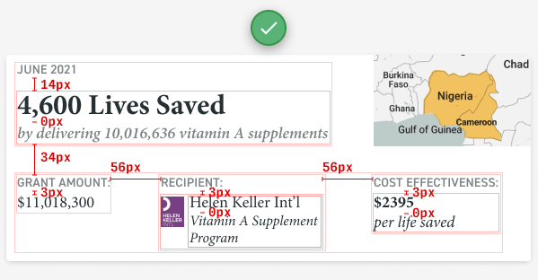
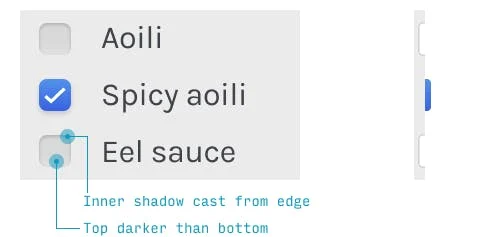
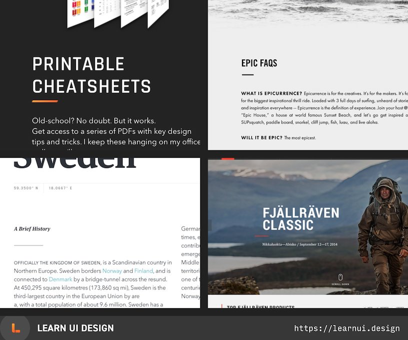

# UI Design

Source: [Design Hacks Newsletter](https://learnui.design/newsletter.html)

[5 Practical Exercises to Learn UI Design (For Free)](https://learnui.design/blog/5-practical-exercises-learn-ui-design-free.html)

[50 UI Design Tips](https://twitter.com/erikdkennedy/status/1328771593934290944)

## Alignment

- Design = Alignment
- You don't have to use a single line but still things are aligned to each other

## Spacing

- Space inside groups less than space between groups

## Placement of UI Controls - Locality!
- Put UI controls on where they effect the change
  - Delete button **on** the email it deletes
- Put UI Controls that act on a group of elements in an area above those elements
  - Search bar on top of page searches the whole page
  - Checkbox over table will select all rows

## Use great fonts
- Check the fonts of great designs
- Have a collection of great fonts

## Use great images

- Free high quality stock photos
  - https://unsplash.com/
  - https://www.pexels.com/

## Use HSB for colors
- It's very intuitive compared to RGB
- You can easily make boring colors more interesting by adjusting their hue slightly
  - For example boring blue to a slightly more purplish hue
- Make color less overpowering/visible by reducing saturation

### Theme color and variations
- Choose a theme color
- Light variation: Increase brightness, decrease saturation
- Dark variation: Decrease brightness, increase saturation
- You can make a secondary theme color that feels related to the first one by strongly adjusting brightness/saturation
  while keeping the hue same

## Light comes from the sky
- Top of things are bright, Shadows are cast below them
  - Checkboxes are darker than the surrounding part and cast shadows

    
  - Content cards are brighter than the background
  - Input fields are darker than the surrounding surface

## Design Motifs
- Use a common theme/motif throughout your design to make it more interesting
  - Hexagonal logo and a triangle grid over the main page image
  - Use the same color or color gradient across the site

## Tiny Underlines
- Tiny underlines make otherwise boring text more interesting

{ height: 400px }

## Example design guidelines/directions/motif

### Playfulness
- Pastel colors (i.e. less saturation and more brightness)
- Scattered elements in the background (to break up the "grid")
- Fonts with imperfect kerning (space between letters) or stroke-weights make things quirky

### Hexagon Logo and scattered triangles

