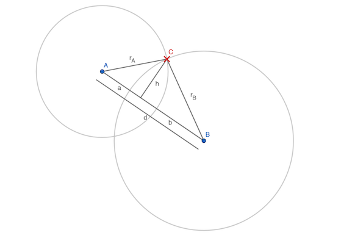
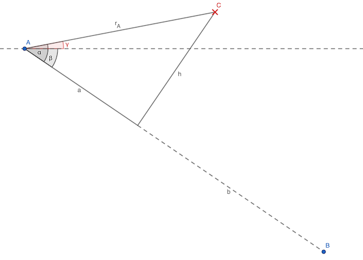

# Find Intersection of two Circles

 
[Geogebra File](assets/misc/circle_intersection_1.ggb)

## Given:

- Points $A$, $B$
  - Gives us the distance $d$ between them
- Radiuses: 
  $
  r_A = \vert\overline{AC}\vert\\
  r_B = \vert\overline{BC}\vert
  $

## Steps

### Finding $a$
The two inner triangles give us:

1. $a^2 + h^2 = r_A^2$
2. $b^2 + h^2 = r_B^2$

Equaling by $h^2$:

$r_A^2 - a^2 = r_B^2 - b^2$

Substituting $b = d - a$:

$r_A^2 - a^2 = r_B^2 - (d - a)^2 \\
\Rightarrow r_A^2 - a^2 = r_B^2 - d^2 + 2da - a^2 \\
\Rightarrow r_A^2 = r_B^2 - d^2 + 2da \\
\Rightarrow a = \frac{r_A^2 - r_B^2 + d^2}{2d}
$

### Calculate angle $\gamma$
 
[Geogebra File](assets/misc/circle_intersection_2.ggb)

Calculate $\alpha$:

$
\alpha = arccos(\frac{a}{r_A})
$

Calculate $\beta$ from the line $\overline{AB}$:

$
\beta = arccos(\frac{\vert x_A - x_B \vert}{d})
$

This will give us the angle $\gamma$ towards the point C:

$
\gamma = \alpha - \beta
$

## Calculate C:

$
\begin{bmatrix}
x_C \\
y_C
\end{bmatrix} =
\begin{bmatrix}
x_A \\
y_A
\end{bmatrix} +
r_A \begin{bmatrix}
cos(\gamma) \\
sin(\gamma)
\end{bmatrix}
$

---

## Alternative: Inverse Kinematics (?)

- $\gamma$ like above: joint angle at A
- $\delta$: joint angle at C

$
\begin{bmatrix}
x_C \\
y_C
\end{bmatrix} =
\begin{bmatrix}
x_A \\
x_B
\end{bmatrix} +
r_A \begin{bmatrix}
cos(\gamma) \\
sin(\gamma)
\end{bmatrix}
$

$
\begin{bmatrix}
x_B \\
y_B
\end{bmatrix} =
\begin{bmatrix}
x_C \\
y_C
\end{bmatrix} +
r_B \begin{bmatrix}
cos(\delta) \\
sin(\delta)
\end{bmatrix}
$

Find $\gamma$ and $\delta$
