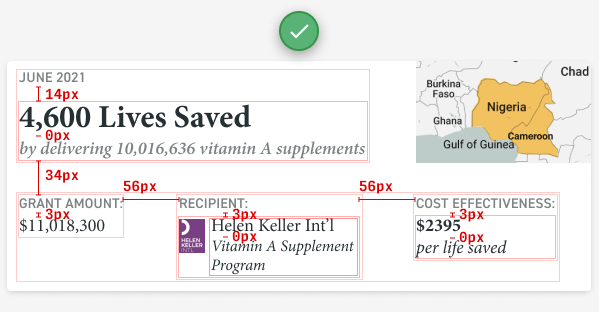

# UI Design

Source: [Design Hacks Newsletter](https://learnui.design/newsletter.html)

[5 Practical Exercises to Learn UI Design (For Free)](https://learnui.design/blog/5-practical-exercises-learn-ui-design-free.html)

## Alignment

- Design = Alignment
- You don't have to use a single line but still things are aligned to each other

## Spacing

- Space inside groups less than space between groups

## Use great fonts
- Check the fonts of great designs
- Have a collection of great fonts

## Use great images

- Free high quality stock photos
  - https://unsplash.com/
  - https://www.pexels.com/

## Use HSL for colors
- It's very intuitive compared to RGB
- You can easily make boring colors more interesting by adjusting their hue
- Make color less overpowering/visible by reducing saturation

## Design principles

## Playfulness
- Pastel colors (i.e. less saturation and more brightness)
- Scattered elements in the background (to break up the "grid")
- Fonts with imperfect kerning (space between letters) or stroke-weights make things quirky
